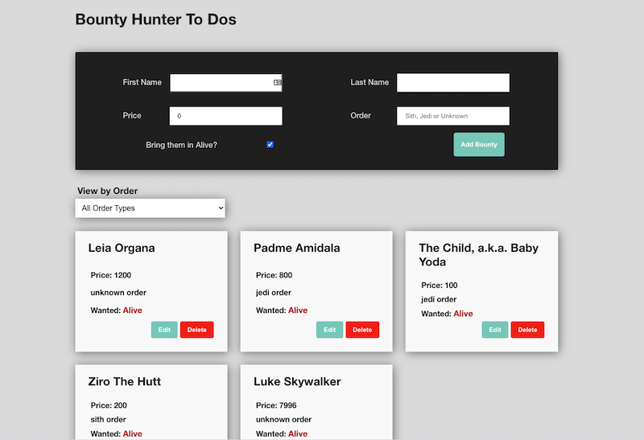

# bounty-hunter

A V School project using Create React App and MongoDB with Express and Mongoose.

The App has a form which sends items to the database. The items are editable and can be sorted by category.

Think of it as a To-Do app with a sense of humor.

